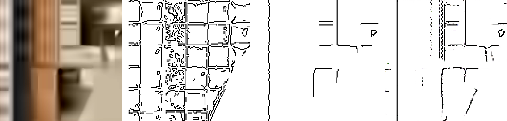
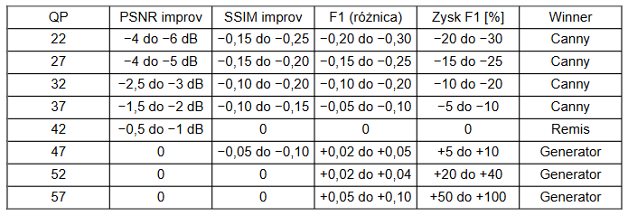

# Edge Recovery in Compressed Images using Pix2Pix GAN
### (Rekonstrukcja krawędzi w obrazach kompresowanych stratnie przy użyciu sieci cGAN)

## 📌 Abstract / Streszczenie

**English:**
This project focuses on the detection and reconstruction of edges in images with reduced quality due to lossy compression. Compression artifacts significantly degrade the performance of traditional edge detection methods, such as the Canny algorithm. To address this, a Deep Learning approach using a **Pix2Pix GAN** (Conditional Generative Adversarial Network) was implemented.

The model consists of a **U-Net generator** with skip connections to preserve spatial information and a **PatchGAN discriminator** to ensure sharp details. The network was trained to map compressed images (with artifacts) to clean edge maps, using the COCO dataset. Quantitative analysis (PSNR, SSIM, Boundary F1 Score, ERC) demonstrates that the proposed model effectively learns edge representation robust to compression artifacts, outperforming classical methods in high-compression scenarios.

**Polski:**
Projekt koncentruje się na problemie detekcji i rekonstrukcji krawędzi w obrazach o obniżonej jakości, wynikającej z kompresji stratnej. Artefakty powstające podczas kompresji w znacznym stopniu pogarszają działanie tradycyjnych metod, takich jak algorytm Canny'ego. W ramach projektu wykorzystano model **Pix2Pix**, będący odmianą warunkowej sieci przeciwstawnej (cGAN).

Architektura modelu składa się z generatora typu **U-Net** oraz dyskryminatora **PatchGAN**. Model uczono transformacji obrazów po kompresji stratnej do map krawędzi. Skuteczność oceniono przy użyciu metryk PSNR, SSIM, Boundary F1 Score oraz współczynnika ERC. Wyniki wskazują, że model Pix2Pix potrafi skutecznie odtworzyć krawędzie nawet przy silnej degradacji obrazu.

## 🧠 Methodology & Architecture

The project implements a supervised learning pipeline dealing with severe compression artifacts (VVC standard).

### 1. Model Architecture
* **Generator (U-Net):** Responsible for generating edge maps. It utilizes skip connections to pass high-resolution details from the encoder to the decoder, which is crucial for precise edge localization.
* **Discriminator (PatchGAN):** Classifies 70x70 patches of the image as real or fake, forcing the generator to produce high-frequency details (sharp edges) rather than blurry approximations.

### 2. Data Pipeline
* **Dataset:** COCO Dataset (train/val), processed into 128x128 patches.
* **Compression Simulation:** Images are compressed using the **VVC (Versatile Video Coding)** standard via VTM software to simulate real-world transmission artifacts.
* **Ground Truth:** Reference edge maps are generated from uncompressed source images using an optimized Canny algorithm.

## 📂 Repository Structure

The code is organized into specific modules handling different stages of the machine learning pipeline:

| File | Description |
|------|-------------|
| `s3a_x52_005_5_tgd.py` | **Core Logic.** Implementation of the Pix2Pix GAN architecture (Generator & Discriminator), loss functions, and the main training loop using TensorFlow. |
| `s3a_x52_005_6_vgd.py` | **Evaluation Engine.** Calculates quantitative metrics (PSNR, SSIM, F1 Score ODS/OIS, ERC) and generates visual comparisons between the Model and Canny algorithm. |
| `conversions.py` | **Data Preparation.** Handles the conversion pipeline: PNG $\to$ YUV $\to$ VVC Encoding (VTM) $\to$ PNG with artifacts. |
| `prepare_coco_dataset.py` | **Preprocessing.** Filters images based on texture complexity and creates crops suitable for training. |
| `generate_canny_edge_maps.py` | **Ground Truth.** Generates target labels (edge maps) for the supervised training process. |

## 📊 Results

The proposed method shows significant improvement over the Canny algorithm in images with high Quantization Parameter (QP > 47).

For example QP=52:

**Figure 1.** Comparison from left to right: Compressed Input, Ground Truth, Standard Canny result, and our network (Pix2Pix) output.

**Figure 2.** Performance gain of the Generator over Canny across varying compression levels (QP). Note the advantage at QP > 42.
## 🛠 Technologies
* **Deep Learning:** TensorFlow 2.15, Keras
* **Computer Vision:** OpenCV, Scikit-image
* **Data Processing:** NumPy, Pandas, FFmpeg
* **Environment:** Docker (Containerized)

---
